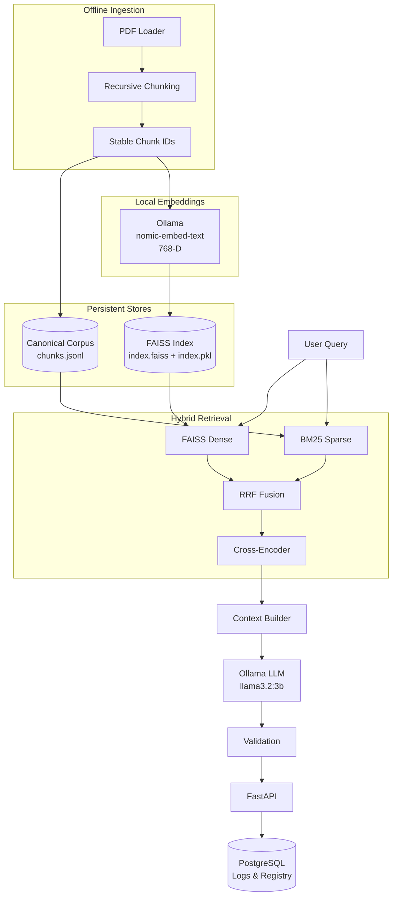

# FinDoc-RAG

<div align="center">

### Local‑First Hybrid Retrieval‑Augmented Generation for Financial Documents

**Private. Local. Explainable. Built for dense financial data.**

A production‑oriented RAG system for analyzing annual reports, SEC filings, and other financial documents using **Ollama, FAISS, BM25, LangGraph, FastAPI, and PostgreSQL**.

<br>


</div>

---

## Overview

**FinDoc-RAG** is a local‑first Retrieval‑Augmented Generation system designed for querying large, information‑dense financial documents. It transforms PDFs into structured, searchable knowledge by combining:

- **Dense semantic retrieval** with FAISS (768‑dim `nomic-embed-text`)
- **Sparse lexical retrieval** with BM25Okapi
- **Hybrid rank fusion** via Reciprocal Rank Fusion (RRF)
- **Cross‑encoder reranking** (`ms-marco-MiniLM-L-6-v2`)
- **Local LLM generation** via Ollama (`llama3.2:3b`)
- **LangGraph‑based orchestration** with structured output validation
- **Asynchronous FastAPI + PostgreSQL** for persistence & observability

**Core principle:** FAISS and BM25 operate on the *same canonical document chunks* using deterministic `chunk_id` values, enabling exact deduplication and transparent citations.

---

## Architecture



*See [docs/architecture.md](docs/architecture.md) for a detailed diagram and component descriptions.*

---

## Key Features

| Feature | Description |
|---------|-------------|
| **Hybrid Retrieval** | FAISS dense + BM25 sparse + Reciprocal Rank Fusion |
| **Cross‑Encoder Reranking** | `ms-marco-MiniLM-L-6-v2` pairwise scoring |
| **Local LLM** | `llama3.2:3b` on host GPU via Ollama – no external API |
| **Deterministic Chunk IDs** | `filename::page_N::chunk_M::hash` enables exact deduplication |
| **Async FastAPI** | Non‑blocking request handling, background query logging |
| **Document Management** | Upload, status polling, deletion with index rebuild |
| **Observability** | Request IDs, latency metrics, PostgreSQL query/response logs |
| **Production Hardening** | CORS, sliding‑window rate limiting, security headers, error sanitization |
| **Docker‑First** | Single `docker compose up -d --build` for full stack |

---

## Technology Stack

| Layer | Technology |
|-------|------------|
| API | FastAPI (async) |
| Orchestration | LangGraph (StateGraph) |
| RAG Components | LangChain |
| Local AI Runtime | Ollama |
| Embeddings | `nomic-embed-text` (768‑D) |
| Dense Retrieval | FAISS (HNSW) |
| Sparse Retrieval | BM25Okapi (`rank-bm25`) |
| Reranking | Cross‑Encoder `ms-marco-MiniLM-L-6-v2` |
| LLM Generation | `llama3.2:3b` (Ollama) |
| Database | PostgreSQL + asyncpg + SQLAlchemy async |
| Config | Pydantic Settings |
| Document Parsing | PyPDFLoader |
| Frontend | React 19 + TypeScript + Vite + Tailwind CSS |
| Reverse Proxy | Nginx (serves SPA, proxies `/api/*`) |
| Public TLS | Cloudflare Named Tunnel |

---

## Project Structure

```text
FinDoc-RAG/
├── app/
│   ├── api/routes/          # FastAPI routers (chat, documents)
│   ├── core/                # Config, logging, middleware, rate‑limiter
│   ├── db/                  # SQLAlchemy models & async session
│   ├── engine/
│   │   ├── ingestion/       # PDF loading, chunking, indexing
│   │   ├── retrieval/       # FAISS, BM25, RRF, Cross‑Encoder
│   │   ├── generation/      # Ollama LLM wrapper
│   │   └── pipelines.py     # LangGraph RAG pipeline
│   ├── schemas/             # Pydantic request/response models
│   └── main.py              # FastAPI app factory
├── data/
│   ├── raw/                 # Uploaded PDFs (git‑ignored)
│   └── vector_store/        # FAISS index + chunks.jsonl (git‑ignored)
├── deploy/cloudflare/       # Cloudflare tunnel config example
├── docs/
│   ├── architecture.md
│   ├── deployment.md
│   └── api.md
├── evaluation/              # Retrieval/rag evaluation scripts
├── frontend/                # React + TS + Vite + Tailwind
├── scripts/                 # One‑off scripts (indexing, verification)
├── tests/                   # pytest suite (34 tests)
├── docker-compose.yml
├── Dockerfile               # Backend image
├── frontend/Dockerfile      # Frontend multi‑stage (nginx)
├── frontend/nginx.conf      # SPA + /api/* proxy
├── requirements.txt
├── .env.example
└── README.md
```

> Generated local retrieval artifacts and private financial documents should normally remain outside version control.

---

## Getting Started

### Prerequisites

- Docker Engine 24+ & Docker Compose v2+
- Linux host with NVIDIA GPU (for Ollama)
- Ollama on host with models:
  ```bash
  ollama pull nomic-embed-text
  ollama pull llama3.2:3b
  ```
- Domain managed on Cloudflare (for production TLS)

### 1. Clone & Configure

```bash
git clone <repo-url>
cd FinDoc-RAG
cp .env.example .env          # edit with production values
```

### 2. Build & Run

```bash
docker compose up -d --build
```

### 3. Verify

```bash
curl http://localhost/health      # {"status":"healthy",...}
curl http://localhost/ready       # {"status":"ready",...}
curl -X POST http://localhost/api/v1/chat \
  -H "Content-Type: application/json" \
  -d '{"query":"What was Tata Steel EBITDA margin in FY2023-24?"}'
```

### 4. Production TLS (Cloudflare Tunnel)

```bash
# Install cloudflared, login, create tunnel
cloudflared tunnel login
cloudflared tunnel create findoc-rag
cloudflared tunnel route dns findoc-rag yourdomain.com

# Configure ~/.cloudflared/config.yml with tunnel UUID & domain
# Run as systemd service: sudo cloudflared service install && sudo systemctl enable --now cloudflared
```

*See [docs/deployment.md](docs/deployment.md) for full details.*

---

## API Overview

| Endpoint | Method | Description |
|----------|--------|-------------|
| `/health` | GET | Liveness probe |
| `/ready` | GET | Readiness (FAISS, BM25, DB, Ollama) |
| `/api/v1/chat` | POST | Grounded financial Q&A |
| `/api/v1/documents/upload` | POST | Upload PDF, async ingestion |
| `/api/v1/documents` | GET | List documents & status |
| `/api/v1/documents/{id}` | GET | Document metadata |
| `/api/v1/documents/{id}` | DELETE | Delete document & rebuild indexes |

*Full API contracts: [docs/api.md](docs/api.md)*  
*Interactive Swagger UI at `/docs` when `DEBUG=true`.*

---

## Testing

```bash
# Backend
cd /path/to/FinDoc-RAG
python -m pytest tests/ -v          # 34 tests, ~110s

# Frontend
cd frontend && npm run build && npm run lint
```

All 34 backend tests pass (unit + integration). Frontend builds successfully.

The cross‑encoder model:

```text
cross-encoder/ms-marco-MiniLM-L-6-v2
```

is downloaded and cached automatically by `sentence-transformers` on first use.

---

## Production Readiness

| Dimension | Score | Notes |
|-----------|-------|-------|
| Functionality | 9/10 | Complete RAG pipeline, document mgmt |
| Reliability | 8/10 | Health/readiness, orphan recovery, graceful errors |
| Security | 9/10 | CORS, rate limits, headers, sanitization |
| Observability | 7/10 | Structured logs, request IDs, latency; no metrics export yet |
| Deployability | 9/10 | Single `docker compose up` |
| Maintainability | 8/10 | Clean architecture, typed, tested |
| Documentation | 8/10 | Architecture, deployment, API docs |
| Scalability | 6/10 | Single‑host; in‑memory limiter; NullPool |

**Overall: 8.1/10 – Production Ready** (see `milestone_17_report.md`).

---

## Roadmap

- [ ] Redis‑backed rate limiter for horizontal scaling
- [ ] Prometheus `/metrics` endpoint + Grafana dashboards
- [ ] Playwright E2E tests (upload → query → sources)
- [ ] Kubernetes manifests / Helm chart
- [ ] Automated backup/restore scripts
- [ ] Auto‑detect page/chunk counts in seeding
- [ ] Support for additional file types (DOCX, XLSX)

---

## License

MIT License – see `LICENSE` (to be added).

---

## Author

**Saptak Mondal**  
Computer Science Engineering — AI/ML & IoT