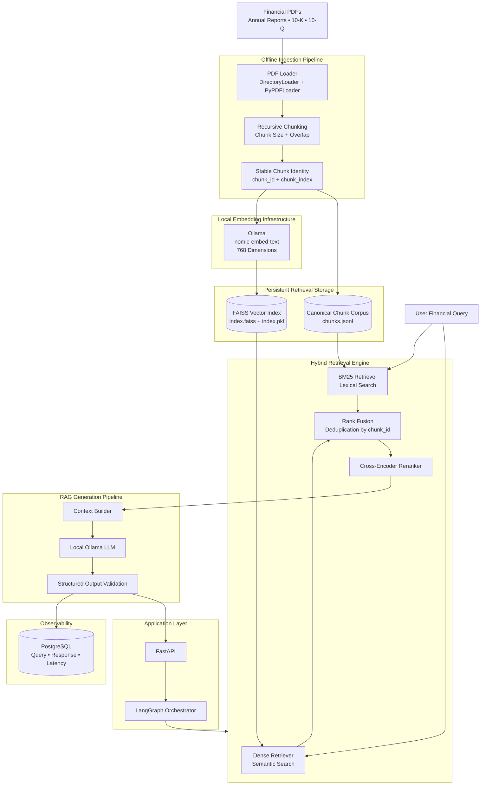

# FinDoc-RAG

<div align="center">

### Local-First Hybrid Retrieval-Augmented Generation for Financial Documents

**Private. Local. Explainable. Built for dense financial data.**

A production-oriented RAG system for analyzing annual reports, SEC filings, and other financial documents using **Ollama, FAISS, BM25, LangGraph, FastAPI, and PostgreSQL**.

<br>


</div>

---

## Overview

**FinDoc-RAG** is a local-first Retrieval-Augmented Generation system designed for querying large and information-dense financial documents.

The system transforms financial PDFs into structured, searchable knowledge by combining:

- **Dense semantic retrieval** with FAISS
- **Sparse lexical retrieval** with BM25
- **Hybrid rank fusion**
- **Cross-encoder reranking**
- **Local LLM inference** through Ollama
- **LangGraph-based RAG orchestration**
- **Asynchronous FastAPI and PostgreSQL infrastructure**

The primary design goal is to build a financial document intelligence system where sensitive documents, embeddings, and retrieval indexes can remain entirely on local infrastructure.

> **Core architectural principle:** FAISS and BM25 operate on the same canonical document chunks using deterministic `chunk_id` values.

---

# Architecture



---

## How It Works

### 1. Document Ingestion

Financial PDFs are placed inside:

```text
data/raw/
```

The ingestion pipeline:

```text
PDF
 ↓
Load Pages
 ↓
Recursive Chunking
 ↓
Assign Stable Chunk IDs
 ↓
 ├──────────────────────┐
 ▼                      ▼
Canonical Corpus     Local Embeddings
chunks.jsonl         nomic-embed-text
                        ↓
                      FAISS
```

Each chunk receives a deterministic identity:

```text
<filename>::page_<page>::chunk_<index>::<hash>
```

Example:

```text
OTC_TATLY_2024.pdf::page_219::chunk_3::a81f29c4e291
```

This allows every retrieval system to reference exactly the same underlying chunk.

---

### 2. Dense Semantic Retrieval

The dense retrieval pipeline uses:

```text
User Query
    ↓
Ollama Embedding
    ↓
768-D Query Vector
    ↓
FAISS Similarity Search
    ↓
Top-K Semantic Matches
```

This retrieval path is useful when the user's query and the relevant document text have similar meanings but use different words.

---

### 3. Sparse Lexical Retrieval

The BM25 retrieval pipeline searches the canonical `chunks.jsonl` corpus.

It complements semantic retrieval by performing strong exact-term matching for information such as:

- Company names
- Financial terminology
- Ticker symbols
- Dates and fiscal years
- Named entities
- Exact phrases
- Rare financial terms

---

### 4. Hybrid Retrieval

The final retrieval architecture combines both approaches:

```text
                  User Query
                      │
             ┌────────┴────────┐
             ▼                 ▼
      Dense Retrieval     Sparse Retrieval
           FAISS               BM25
             │                 │
             └────────┬────────┘
                      ▼
                  Rank Fusion
                      ↓
                Deduplication
                  by chunk_id
                      ↓
             Cross-Encoder Reranking
                      ↓
                Final Context
```

This provides better retrieval coverage than relying exclusively on either semantic or keyword search.

---

## Current Pipeline Statistics

The current development corpus contains a large financial annual report used for ingestion and retrieval testing.

| Metric | Result |
|---|---:|
| PDF Pages Loaded | 581 |
| Document Chunks | 2,710 |
| Unique Chunk IDs | 2,710 |
| Embedding Dimensions | 768 |
| FAISS Vectors | 2,710 |
| Canonical Corpus Entries | 2,710 |
| Cross-Store Coverage | 100% |

The complete ingestion pipeline currently processes the test corpus in approximately **105 seconds** on the development machine.

---

# Tech Stack

| Layer | Technology |
|---|---|
| API | FastAPI |
| AI Orchestration | LangGraph |
| RAG Components | LangChain |
| Local AI Runtime | Ollama |
| Embeddings | `nomic-embed-text` |
| Dense Retrieval | FAISS |
| Sparse Retrieval | BM25 |
| Reranking | Cross-Encoder |
| Database | PostgreSQL |
| ORM | SQLAlchemy Async |
| PostgreSQL Driver | asyncpg |
| Configuration | Pydantic Settings |
| Document Parsing | PyPDFLoader |

---

# Project Structure

```text
FinDoc-RAG/
│
├── app/
│   │
│   ├── api/
│   │   └── routes/
│   │
│   ├── core/
│   │   ├── config.py
│   │   └── logger.py
│   │
│   ├── db/
│   │   ├── models.py
│   │   └── session.py
│   │
│   ├── engine/
│   │   │
│   │   ├── ingestion/
│   │   │   ├── ingestor.py
│   │   │   └── chunk_store.py
│   │   │
│   │   ├── retrieval/
│   │   │   └── retriever.py
│   │   │
│   │   ├── generation/
│   │   │
│   │   └── pipelines.py
│   │
│   ├── schemas/
│   │
│   └── main.py
│
├── data/
│   ├── raw/
│   └── vector_store/
│       ├── index.faiss
│       ├── index.pkl
│       └── chunks.jsonl
│
├── scripts/
│   └── index_documents.py
│
├── evaluation/
├── tests/
│
├── requirements.txt
├── .env
└── README.md
```

---

# Getting Started

## 1. Prerequisites

Make sure the following are installed:

- Python 3.12
- Miniconda or Anaconda
- Ollama
- PostgreSQL
- Git

---

## 2. Clone the Repository

```bash
git clone <your-repository-url>
cd FinDoc-RAG
```

---

## 3. Create the Conda Environment

```bash
conda create -n findoc-rag python=3.12
conda activate findoc-rag
```

Install dependencies:

```bash
pip install -r requirements.txt
```

---

## 4. Install Ollama Models

Make sure Ollama is running locally.

Pull the embedding model:

```bash
ollama pull nomic-embed-text
```

Pull the configured generation model:

```bash
ollama pull llama3.2:3b
```

Verify installed models:

```bash
ollama list
```

---

## 5. Environment Configuration

Create a `.env` file in the project root.

```env
APP_NAME=FinDoc-RAG
APP_ENV=development
DEBUG=true

OLLAMA_BASE_URL=http://localhost:11434
LLM_MODEL=llama3.2:3b
EMBEDDING_MODEL=nomic-embed-text

DATABASE_URL=postgresql://<username>:<password>@localhost:5432/findoc_rag

RAW_DATA_PATH=./data/raw
VECTOR_STORE_PATH=./data/vector_store

CHUNK_SIZE=1000
CHUNK_OVERLAP=200

TOP_K=10
FINAL_CONTEXT_K=3
```

> Never commit your real `.env` file or database credentials to Git.

---

# Document Ingestion

Place financial PDF documents inside:

```text
data/raw/
```

Supported document types currently include financial PDFs such as:

- Annual reports
- SEC 10-K filings
- SEC 10-Q filings
- Earnings reports
- Financial disclosures

Run the production ingestion pipeline:

```bash
python scripts/index_documents.py
```

The pipeline performs:

```text
Load PDFs
    ↓
Split into Chunks
    ↓
Assign Stable Chunk IDs
    ↓
Save Canonical Chunk Corpus
    ↓
Generate Embeddings in Batches
    ↓
Build FAISS Index
    ↓
Persist Retrieval Assets
```

Generated retrieval artifacts are stored inside:

```text
data/vector_store/
```

---

# Running the API

Start the FastAPI development server:

```bash
uvicorn app.main:app --reload
```

The current health endpoint can be used to verify that the application is running.

Interactive API documentation is available through the FastAPI Swagger interface after starting the server.

---

# Development Progress

### Milestone 1 — Core Foundation

**Status: Complete**

- [x] Project architecture
- [x] Conda environment
- [x] Pydantic configuration
- [x] Application logging
- [x] FastAPI foundation
- [x] Health endpoint

### Milestone 2 — Database & Ingestion Infrastructure

**Status: Complete**

- [x] Async PostgreSQL connection
- [x] SQLAlchemy session management
- [x] Query logging model
- [x] PDF loading
- [x] Recursive document chunking
- [x] Deterministic chunk IDs
- [x] Local Ollama embeddings
- [x] Batched embedding pipeline
- [x] FAISS index creation
- [x] FAISS persistence and reload
- [x] Canonical JSONL chunk corpus
- [x] Cross-store consistency validation

### Milestone 3 — Hybrid Retrieval Engine

**Status: In Progress**

- [x] Dense FAISS retrieval
- [x] Semantic retrieval testing
- [x] Retrieval distance scores
- [ ] BM25 sparse retrieval
- [ ] Rank fusion
- [ ] Chunk-level deduplication
- [ ] Hybrid retrieval evaluation

### Upcoming

- [ ] Cross-encoder reranking
- [ ] Context construction
- [ ] Local LLM generation
- [ ] LangGraph orchestration
- [ ] Production RAG API
- [ ] Retrieval evaluation
- [ ] RAG evaluation
- [ ] Automated testing
- [ ] Docker deployment
- [ ] CI/CD

---

# Privacy-First Architecture

FinDoc-RAG is designed around a **local-first processing model**.

The following components can remain entirely on the user's machine:

```text
Financial Documents
        +
Document Chunks
        +
Embeddings
        +
FAISS Index
        +
BM25 Corpus
        +
Retrieved Context
        +
Local LLM Inference
```

This architecture is particularly relevant for financial workflows where documents may contain confidential or sensitive business information.

A future version may explore privacy-preserving hybrid local/cloud reasoning where sensitive information is sanitized locally before external reasoning is performed.

---

# Engineering Principles

The project follows several architectural principles:

**Single canonical corpus**  
Dense and sparse retrieval operate on identical document chunks.

**Stable chunk identity**  
Every chunk receives a deterministic `chunk_id` for synchronization, deduplication, debugging, and evaluation.

**Local-first AI**  
Embeddings and LLM inference can run through Ollama without requiring paid external APIs.

**Controlled embedding batches**  
Large corpora are embedded incrementally to avoid overwhelming the local inference runtime.

**Separation of concerns**  
Ingestion, retrieval, generation, API infrastructure, database access, and orchestration are maintained as independent modules.

---

# Roadmap

```text
Document Ingestion                         ✅
        ↓
Canonical Chunk Corpus                     ✅
        ↓
Dense FAISS Retrieval                      ✅
        ↓
BM25 Sparse Retrieval                      🚧
        ↓
Hybrid Rank Fusion                         ⏳
        ↓
Cross-Encoder Reranking                    ⏳
        ↓
Context Construction                       ⏳
        ↓
Local LLM Generation                       ⏳
        ↓
LangGraph Orchestration                    ⏳
        ↓
Production RAG API                         ⏳
        ↓
Evaluation + Optimization                  ⏳
        ↓
Deployment                                 ⏳
```

---

## Author

**Saptak Mondal**

Computer Science Engineering — AI/ML & IoT

---

<div align="center">

### FinDoc-RAG

**Turning dense financial documents into searchable, grounded intelligence.**

</div>
