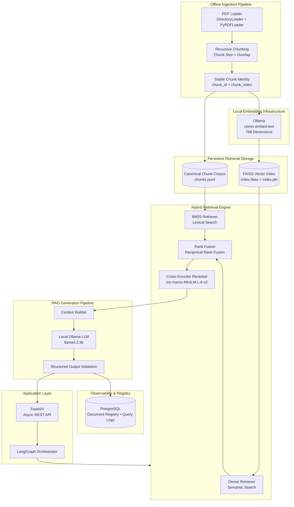
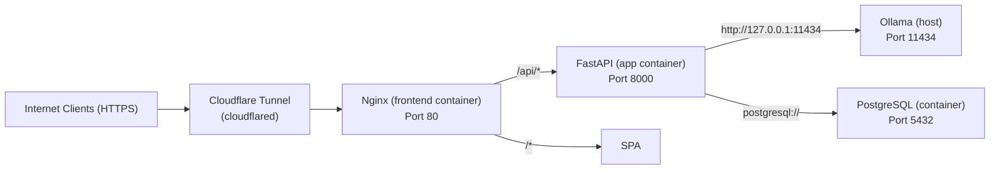

# FinDoc-RAG Architecture

## Overview

FinDoc-RAG is a local-first, hybrid Retrieval-Augmented Generation (RAG) system designed for financial document intelligence. It combines dense semantic search (FAISS), sparse lexical search (BM25), reciprocal rank fusion (RRF), cross‑encoder reranking, and local LLM generation via Ollama.

## System Components

## Data Flow

1. **Ingestion** (offline): PDFs → pages → recursive chunks → deterministic `chunk_id` → persisted to `chunks.jsonl` and embedded into FAISS.
2. **Query Time**: User query → embed → dense (FAISS) + sparse (BM25) → RRF fusion → cross‑encoder rerank → top‑K chunks → context → local LLM → grounded answer + citations.
3. **Observability**: Every query/response/latency logged to PostgreSQL asynchronously.

## Key Design Principles

- **Deterministic Chunk Identity**: `chunk_id = filename::page_N::chunk_M::hash` enables exact deduplication across dense/sparse stores.
- **Local‑First**: All models (embeddings, LLM, cross‑encoder) run locally via Ollama; no external API calls.
- **Hybrid Retrieval**: Dense + sparse + RRF + cross‑encoder gives higher recall than either alone.
- **Async FastAPI**: Non‑blocking request handling, background query logging.
- **Production Hardening**: CORS, rate limiting, request IDs, security headers, input validation, duplicate detection, processing state machine.

## Component Details

| Layer | Technology |
|-------|------------|
| API | FastAPI (async) |
| Orchestration | LangGraph (StateGraph) |
| RAG Components | LangChain |
| Local AI Runtime | Ollama |
| Embeddings | `nomic-embed-text` (768‑dim) |
| Dense Retrieval | FAISS (HNSW) |
| Sparse Retrieval | BM25Okapi (rank‑bm25) |
| Reranking | Cross‑Encoder `ms-marco-MiniLM-L-6-v2` |
| LLM Generation | `llama3.2:3b` (Ollama) |
| Database | PostgreSQL (asyncpg + SQLAlchemy async) |
| Config | Pydantic Settings |
| Document Parsing | PyPDFLoader |

## Data Stores

| Store | Format | Purpose |
|-------|--------|---------|
| `data/raw/` | PDF files | Original uploads (git‑ignored) |
| `data/vector_store/chunks.jsonl` | JSONL | Canonical chunk corpus for BM25 |
| `data/vector_store/index.faiss` + `index.pkl` | FAISS binary + pickle | Dense vector index |
| PostgreSQL `documents` table | Relational | Document registry, processing state |
| PostgreSQL `query_logs` table | Relational | Query, response, latency logs |

## Deployment Topology

*Single public entry point (port 80) → Nginx serves SPA and proxies `/api/*` to FastAPI.*

## Security Boundaries

- **Network**: Only port 80 exposed publicly (via Cloudflare). Ollama and PostgreSQL never exposed.
- **CORS**: Configurable allow‑list; production uses single origin.
- **Rate Limiting**: Sliding‑window per‑IP (chat 30/min, upload 10/min, delete 10/min).
- **Headers**: `X-Content-Type-Options: nosniff`, `X-Frame-Options: DENY`, `Referrer-Policy`.
- **Error Sanitization**: No stack traces leaked; generic 500 with request ID.
- **File Upload**: Magic‑byte validation, 50 MB limit, filename sanitisation, SHA‑256 dedup.

## Scalability Considerations

| Aspect | Current | Scaling Path |
|--------|---------|--------------|
| API | Single FastAPI process (`network_mode: host`) | Horizontal via Redis‑backed rate limiter, multiple replicas behind LB |
| Ollama | Host GPU, single process | Multi‑GPU or dedicated inference server |
| PostgreSQL | Single container | Read replicas, connection pooling |
| Rate Limiter | In‑memory | Redis‑backed sliding window |
| Vector Store | Single FAISS index | Sharded FAISS / Milvus / Qdrant |

---

*Document version: 1.0*  
*Last updated: 2025‑08‑27*